<h1 align="center">👋 Hi, I'm Maleesha Prabashwara Kumarasinghe</h1>

<h3 align="center">
🎓 BSc Information Technology Undergraduate
&nbsp; | &nbsp;
💻 Developer
&nbsp; | &nbsp;
🤖 AI & Data Science Enthusiast
</h3>

  
  
  

---

## 👨‍💻 About Me

I'm **Maleesha Prabashwara Kumarasinghe**, an undergraduate student pursuing a **Bachelor of Science in Information Technology** at **The Open University of Sri Lanka**.

I enjoy turning concepts into useful software, exploring **Artificial Intelligence and Data Science**, and creating practical ICT learning resources.

I'm currently building my skills through programming, academic projects, research, experimentation, and continuous self-learning.

- 🎓 BSc Information Technology undergraduate
- 🤖 Interested in Artificial Intelligence & Data Science
- 💻 Programming with **Java** and **Python**
- 🗄️ Interested in databases and information systems
- 🔬 Exploring technology research and data analysis
- 📚 Interested in ICT education and knowledge sharing
- 🌱 Always learning and building

---

## 🛠️ Tech Stack

### 💻 Programming Languages

  

  <b>Java • Python</b>

### 🔧 Tools & Development

  

  <b>IntelliJ IDEA • Visual Studio Code • Git • GitHub</b>

### 🌐 Web Technologies

  

  <b>HTML • CSS • React • TypeScript • Tailwind CSS</b>

---

## 🌱 Currently Exploring

  

- 🤖 Artificial Intelligence
- 🧠 Machine Learning
- 📊 Data Science
- 🌐 Modern Web Development
- 🗄️ Database Technologies
- 💻 Software Development

---

## 🚀 Featured Projects

### 📘 [java-operator-projects](https://github.com/maleesha2525/java-operator-projects)

A visual classification guide for programming fundamentals and Java operators, designed to make programming concepts easier to understand.

**Focus:** Java • Programming Fundamentals • Education

---

### 📚 [Master ICT](https://github.com/maleesha2525/master-ict)

ICT learning resources and lesson ideas covering hardware, networks, programming, and ICT education.

**Focus:** ICT • Education • Programming

---

### 📊 [Crypto Market Tracker](https://github.com/maleesha2525/crypto-market-tracker)

A data-analysis project focused on Bitcoin market movement, patterns, and exploring AI-based possibilities in market analysis.

**Focus:** Data Analysis • Bitcoin • AI Exploration

---

> 🚧 More projects are currently being developed and documented.

---

## 🔬 Research Interests

| Area | Interests |
|---|---|
| 🤖 Artificial Intelligence | Intelligent systems & machine learning |
| 📊 Data Science | Data analysis & data-driven solutions |
| 💻 Software Development | Application development & problem solving |
| 🗄️ Databases | Data modeling & data management |
| 🔐 IT Continuity | Technology resilience & continuity planning |
| 🌐 Emerging Technology | Practical applications of innovative technologies |

---

## 🎓 Academic Journey

### Bachelor of Science in Information Technology

**The Open University of Sri Lanka**

📅 **Expected Graduation: 2028**

My academic journey is helping me build a practical foundation in programming, databases, information systems, software development, project evaluation, documentation analysis, and technology research.

---

## 🧠 Skills

### Technical Skills

`Java` `Python` `HTML` `CSS` `SQL` `Git` `GitHub`

### Professional Skills

`Problem Solving`
`Critical Thinking`
`Research`
`Communication`

`Documentation`
`Presentation`
`Knowledge Sharing`
`Self-Learning`

---

## 📊 GitHub Analytics

  
  

---

## 🔥 GitHub Streak

  

---

## 🐍 Contribution Activity

  

---

## 📫 Connect With Me

---

## 💡 Personal Philosophy

> **Learn. Build. Share. Improve.**

I believe that continuous learning, practical experimentation, and sharing knowledge are essential for growing as an IT professional.

---

  <b>🌱 Always Learning • 💻 Always Building • 🚀 Always Improving</b>

  ⭐ Thanks for visiting my GitHub profile! ⭐

